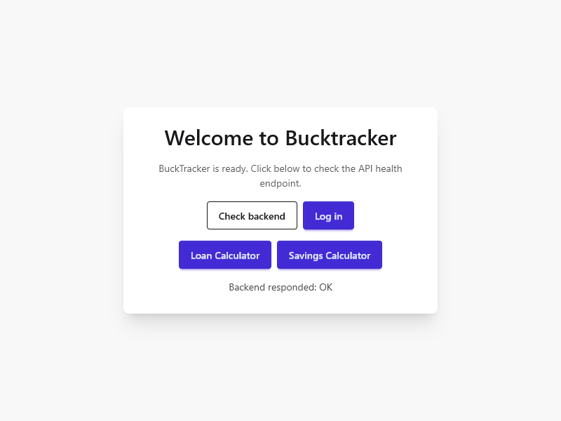
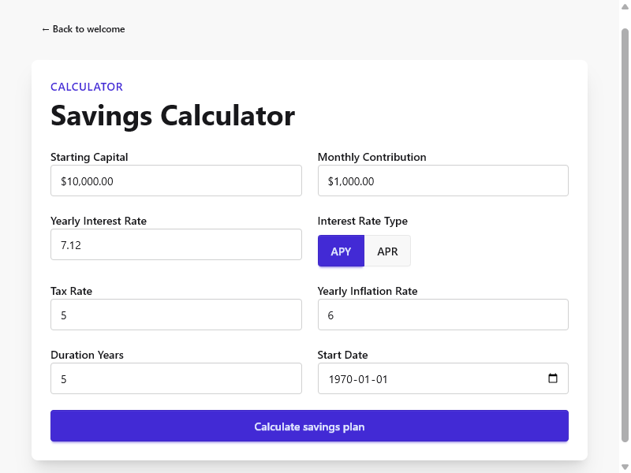
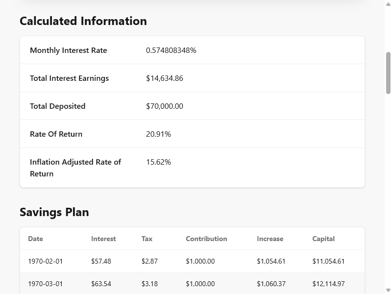
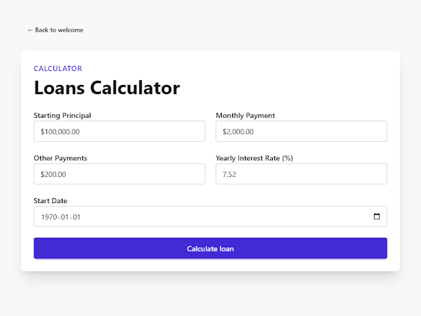
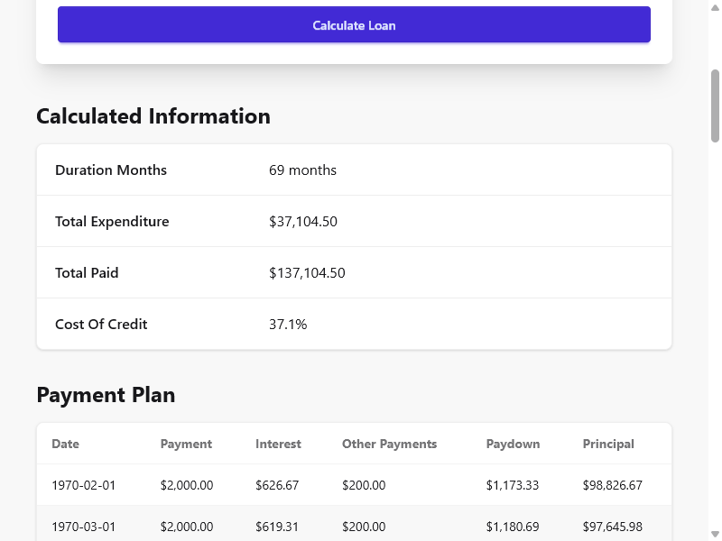

# BuckTracker

**A REST API with useful Savings and Loans calculations.**

Currently, it can help you:

1. Calculate your future savings on a savings account, depending on how much you wish to deposit every month, what interest rate it has, the term, and other parameters.
2. Calculate how long it will take you to pay a loan, what your cost of credit will be, depending on the interest rate, your monthly payments, and other parameters. 

## Motivation

I often find myself making finance-related questions, like:

- If I deposit x amount each month on my savings account, how much will I have after y years at this rate?
- How much are my savings really growing, considering inflation?
- If I take an x-year loan instead of a y-year one, how much more money will I end up paying?
- How much earlier will my loan be paid if I make a paydown now?

I used to make these calculations on spreadsheets, but they become harder to manage with more complex calculations. Instead, I decided to build this RESTful API to implement these calculations more easily.

## Technologies Used

- Go
- PostgreSQL

# Quick Start

## Prerequisites

To run the project, make sure you have [Docker](https://www.docker.com/products/docker-desktop/) installed and running.

## Clone the repository

```bash
git clone git@github.com:Mr-Rafael/bucktracker-api.git
cd bucktracker-api
```

## Run with Docker Compose

From the project root, start the stack:

```bash
docker compose up --build -d
```

This command builds the images and starts the following containers:

| Container | Role |
|---|---|
| `db` | PostgreSQL 15 database on port `5432`. Data is stored in the `bucktracker-api_postgres_data` volume. |
| `migrate` | One-shot Goose job that applies the SQL migrations in `backend/internal/db/migrations`, then exits. |
| `backend` | The BuckTracker REST API server. |
| `frontend` | The BuckTracker web UI, served by nginx. |

## Access the app

Once the containers are up:

- **API:** [http://localhost:8080](http://localhost:8080) — health check at [http://localhost:8080/api/healthz](http://localhost:8080/api/healthz)
- **Frontend:** [http://localhost:3000](http://localhost:3000)

To stop the stack:

```bash
docker compose down
```

# Using the App

Access the app at: [http://localhost:3000](http://localhost:3000). You will be shown a Welcome screen:



You can check if the backend is running at the Welcome Page.

## Using the Calculators

You can navigate to the loan and savings calculators without having a user, from the Welcome screen.

### Savings Calculator



The savings calculator allows you to calculate your savings in an account after a determined period. You can specify the following fields:

| Field | Description |
| ----------- | ----------- |
| Starting Capital | The amount in your account at the beginning of the term. |
| Monthly Contribution | The monthly amount you will deposit in the account (can be 0). |
| Yearly Interest Rate | The yearly interest rate of your account. |
| Interest Rate Type | Banks normally provide the yearly interest rate as APY (Annual Percentage Yield), but in case it gives an APR (Annual Percentage Rate), you can set it here. |
| Tax Rate | You can include an Income Tax Rate in the calculation. You can leave it as 0 to ignore it. |
| Yearly Inflation Rate | You can include a Yearly Inflation Rate in the calculation, to see the real growth of your savings. You can leave it as 0 to ignore it. |
| Duration Years | The duration of the term you wish to calculate for. |
| Start Date | The start date of the savings investment. |

Clicking on Calculate Savings Plan will run calculations and return the following information:



| Field | Description |
| ----------- | ----------- |
| Monthly Interest Rate | The yearly interest rate you entered, converted to a monthly one. This is used in the actual month-to-month interest calculations. |
| Total Interest Earnings | The sum of all the interest amounts generated during the period. |
| Total Deposited | The sum of all the deposits you made during the period, including the initial deposit. |
| Rate of Return | Your total savings at the end of the period divided by the total deposited as a percent. |
| Inflation Adjusted Rate of Return | How much your savings really grew, when considering the inflation you entered. |

Additionally, it will generate a month-to-month status report of your savings account, with the following fields:

| Field | Description |
| ----------- | ----------- |
| Date | The date of the status. |
| Interest | The interest earned that month. |
| Tax | The taxes deducted from the interest profits that month. |
| Contribution | The amount you will deposit that month. |
| Increase | By how much your savings increased that month. |
| Capital | The total on your account at the end of that month. |

### Loans Calculator



The loans calculator allows you to calculate the duration of a loan, and some other details, based on the following fields:

| Field | Description |
| ----------- | ----------- |
| Starting Principal | The principal of the loan at the start of the loan. |
| Monthly Payment | The monthly payments you  will make. |
| Other Payments | Total amount included in your monthly payments that doesn't go to interest or principal. For example, insurances, taxes, etc. |
| Yearly Interest Rate | The yearly interest rate (APR) of your loan. |
| Start Date | The start date of the loan. |

Clicking on Calculate loan will run calculations and return the following information:



| Field | Description |
| ----------- | ----------- |
| Starting Principal | The principal of the loan at the start of the loan. |
| Monthly Payment | The monthly payments you  will make. |
| Other Payments | Total amount included in your monthly payments that doesn't go to interest or principal. For example, insurances, taxes, etc. |
| Yearly Interest Rate | The yearly interest rate (APR) of your loan. |
| Start Date | The start date of the loan. |

Additionally, it will generate a month-to-month status report of your loan, with the following fields:

| Field | Description |
| ----------- | ----------- |
| Date | The date of the status. |
| Payment | The payment made that month. |
| Interest | The interest charged that month. |
| Other Payments | The amount of the payment that went into other payments (not interest or principal). |
| Paydown | The amount paid directly to principal. |
| Paydown | The remaining principal at the end of the month. |

## Contributing

### Clone the repo

```bash
git clone https://github.com/Mr-Rafael/bucktracker-api.git
cd bucktracker-api
```

### Run the unit test suite

```bash
go test ./internal/...
```

### Build the compiled binary

```bash
go build
```

### Submit a pull request

If you'd like to contribute, please fork the repository and open a pull request to the `main` branch.

# API Documentation

Endpoint request and response details live in [docs/api.md](docs/api.md).

# Collaborators</h2>
<table>
  <tr>
    <td align="center">
      <a href="#">
        <br>
        <sub>
          <b>Rafael Mazariegos (Mr-Rafael)</b>
        </sub>
      </a>
    </td>
  </tr>
</table>
